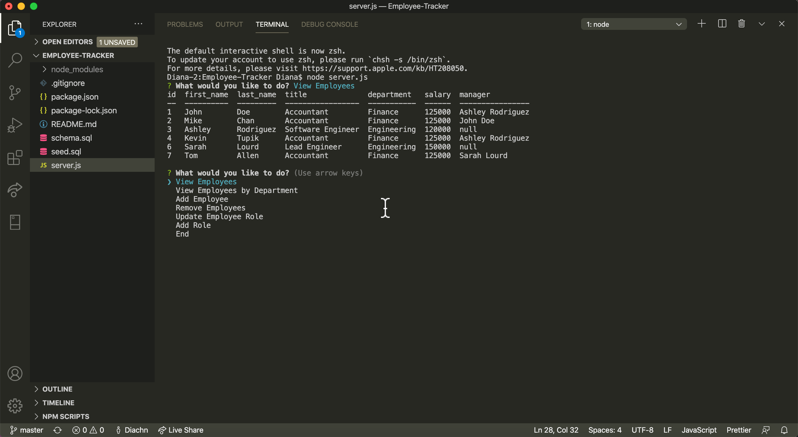

# Employee-Tracker
Creating an employee tracker using MySql and inquirer to gather user's data when they are prompted to answer some questions about an employee.

USER STORY: 
As a CEO, I want to collect information about my employees such as their job titles, which department they belong to, their salaries, and who their manager is.

Here is a video walk through: https://drive.google.com/file/d/1th5rE5XU8HdgrHOiajKbsc45cIwiMWrg/view?usp=sharing

